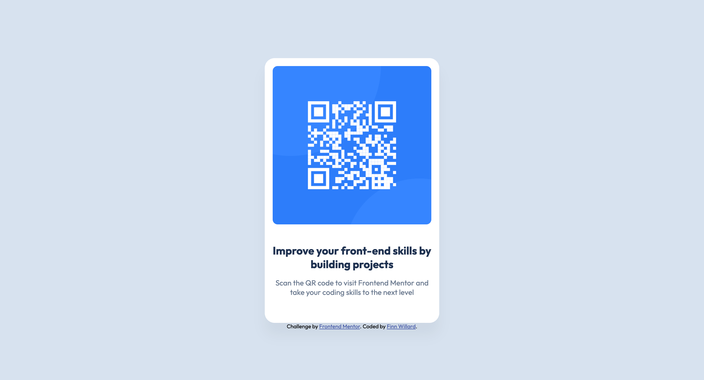

# Frontend Mentor - QR code component solution

This is a solution to the [QR code component challenge on Frontend Mentor](https://www.frontendmentor.io/challenges/qr-code-component-iux_sIO_H). Frontend Mentor challenges help you improve your coding skills by building realistic projects. 

## Table of contents

- [Frontend Mentor - QR code component solution](#frontend-mentor---qr-code-component-solution)
  - [Table of contents](#table-of-contents)
  - [Overview](#overview)
    - [Screenshot](#screenshot)
    - [Links](#links)
  - [My process](#my-process)
    - [Built with](#built-with)
    - [Continued development](#continued-development)
  - [Author](#author)

## Overview

### Screenshot

### Links

- [Solution Github](https://github.com/fwillard/frontend-mentor-qr-code)
- [Live Site](https://fwillard.github.io/frontend-mentor-qr-code/)

## My process

### Built with

- Semantic HTML5 markup
- CSS custom properties
- Flexbox

### Continued development
  Better responsive design for smaller screen sizes. The card does not properly scale on screens smaller than 350px wide.

## Author
- Frontend Mentor - [@fwillard](https://www.frontendmentor.io/profile/fwillard)